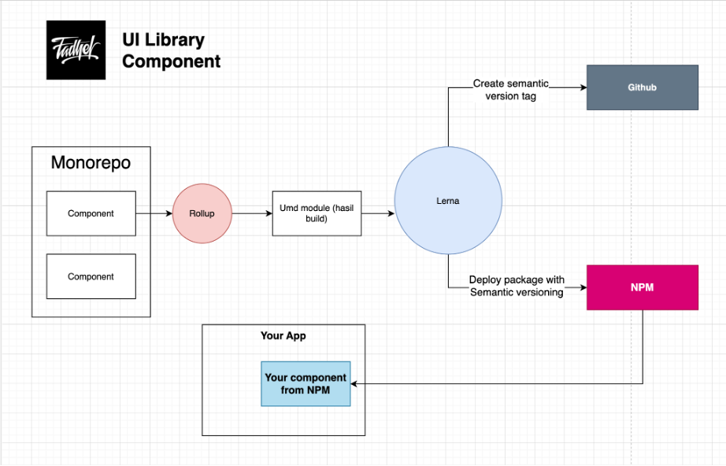
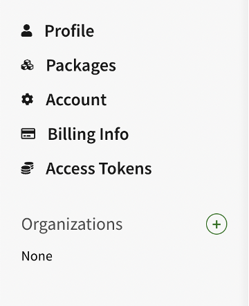

import { Image } from "astro:assets"
import Button from "@/Components/Button.astro";
import Header from "@/Components/header";
import Layout from "Containers/layout";
import { prefix } from "Consts/config";
import Navbar from "Containers/navbar/navbar";
import inputOrganizationImg from "./img/input-organization.png";
import skipOrganizationImg from "./img/skip-organization.png";
import resOrganizationImg from "./img/result-organization.png";
import acccessNpmrc from "./img/access-token-npmrc.png";
import generateTokenNpmrc from "./img/generate-new-token-npmrc.png";
import newAcccessNpmrc from "./img/new-access-token-npmrc.png";
import resultNpmrc from "./img/result-npmrc.png";
import rollupComponent from "./img/rollup-component.png";
import build from "./img/build.png";
import buildFolder from "./img/build-folder.png";
import jsonPublish from "./img/json-publish.png";
import resPublish from "./img/result1-publish.png";
import res2Publish from "./img/result2-publish.png";
import resnpmPublish from "./img/result-npm-publish.png";
import resgithubPublish from "./img/result-github-publish.png";
import compStructure from "./img/component-structure.png";

{/* # {frontmatter.title} */}

<Layout titlePage={frontmatter.postTitle}>
  {/* <Header slot="Header" /> */}
  <Navbar client:load/>
  <Header variant="blog" {...frontmatter}/>
  <article class="prose lg:prose-xl text-[#2e3e6a] p-8 md:p-0 md:container mx-auto place-items-start content-start">


      <div class="grid grid-cols-1 md:grid-cols-3 items-center gap-x-20 my-5">
  <div>
  <iframe width="100%" height="315" src="https://www.youtube.com/embed/PEz2d49XTk0?si=s8NWcy50rX0kt4nj&amp;controls=0" title="YouTube video player" frameborder="0" allow="accelerometer; autoplay; clipboard-write; encrypted-media; gyroscope; picture-in-picture; web-share" allowfullscreen></iframe>
  </div>

{" "}

<div class="col-span-2">


  <h1 class="my-5">Sum 41 - Underclass Hero</h1>

  Setel musik dulu biar ga bete
</div>

  </div>

  <hr/>

  ## Final Source Code
  [Source Code](https://github.com/fadhelmurphy/mamatgarem-ui-starter)
  <hr/>
  <div class="grid grid-cols-1 md:grid-cols-3 items-center gap-x-20 my-5">
  <h1 class="!m-0">Kenapa Implement?</h1>

{" "}

<div class="col-span-2">
  Ketika sedang mengerjakan berbagai macam project (misalkan ada 5 project)
  dengan desain Component yang sama, kalau dengan copas code component dari
  project A ke project C,B,D,E itu repot cuuy yakali copas code navbar
  (component) ke 5 project.
</div>

  </div>
  <div class="dotsep"/>
  <div class="grid grid-cols-1 md:grid-cols-3 items-center gap-x-20 my-5">
  <h3 class="!m-0">1 component berubah nanti project lain ikutan berubah? <span class="text-teal-500">Kaga dong cuy</span></h3>

{" "}

<div class="col-span-2">
  Pada tutorial kali ini gue menerapkan versioning dengan menggunakan lerna,
  sehingga jika project A melakukan update component versi ke 1.0.2 tetapi pada
  project B masih ingin menggunakan versi 1.0.1 itu tidak masalah. kecuali, pada
  project B menggunakan versi @latest
</div>

  </div>

  <div class="dotsep"/>
      <div class="grid grid-cols-1 md:grid-cols-3 items-center gap-x-20 my-5">
  <h1 class="!m-0">Monorepo?</h1>

{" "}

<div class="col-span-2">
  Yoii, gue menerapkan monorepo yang mana semua component ini dalam 1
  node_modules yang sama di dalam satu repo (centralize node_modules) dan ketika
  component lu dependencies ke component lain manggilnya juga gampang tinggal
  @mangkodir-ui/my_component
</div>

  </div>
  <div class="dotsep"/>
  <div class="my-5">

{" "}

<h1 class="!m-0">Nanti pake componentnya gimana cuy?</h1>

{" "}

<p class="!my-5">
  lu nanti tinggal install aja melalui package manager seperti yarn atau npm dan tinggal panggil aja deh component nya.
</p>

```
// kalo pake npm
npm install @mangkodir-ui/button@1.0.0

// kalo pake yarn
yarn add @mangkodir-ui/button@1.0.0
```

```jsx
import Button from "@mangkodir-ui/button";

<Button>Sekuut</Button>
```

  </div>

{" "}

<hr />

# Diagram

  <center>

  
  </center>

  <div class="dotsep" />

  Jadi kita akan membuat semua component dalam satu repo (Monorepo) yang menggunakan 1 node_modules dan dapat melakukan sharing antar component.
  Rollup akan melakukan build component yang hasilnya merupakan module umd, hasil build tersebut akan di publish menggunakan lerna. 
  Lerna akan melakukan push tag (untuk mempermudah jika ingin melakukan rollback) ke repo github dan publish component ke npmjs.com. 
  ketika component sudah di publish di npmjs.com, component dapat di install dan digunakan.

{" "}

<hr />

      <div class="grid grid-cols-1 md:grid-cols-2 items-start gap-x-20 my-5">
  # Registration

{" "}

<div class="col">

Buat dulu akun lu di npm.
https://www.npmjs.com/signup
</div>

  </div>

Setelah login, bikin dulu organizationnya di npm. Klik tombol + pada Organizations.

{" "}

<div class="dotsep" />

    <center>


  </center>

{" "}

<div class="dotsep" />

Terus lu masukin deh tuh nama library lu, misalkan disini gue namanya <b class="text-teal-500">@mangkodir-ui</b>.

    <div class="dotsep"/>

    <center>

  <Image alt="membuat component library" src={inputOrganizationImg} />
  </center>

{" "}

<div class="dotsep" />

Setelah itu klik skip this for now aja.

{" "}

<div class="dotsep" />

    <center>

  <Image alt="membuat component library" src={skipOrganizationImg} />
  </center>

{" "}

<div class="dotsep" />

Nanti hasilnya kek gini.

    <div class="dotsep"/>


    <center>

  <Image alt="membuat component library" src={resOrganizationImg} />
  </center>

{" "}

<hr />
  <div class="grid grid-cols-1 md:grid-cols-3 items-start gap-x-20 my-5">
  # Generate Token

{" "}

<div class="col-span-2">
  Setelah lu registrasi dan buat organization di npm, kita perlu bikin file
  .npmrc di device biar bisa publish package lu.
</div>

  </div>

Sekarang, lu balik lagi ke dashboard website npmjs.com. dibagian sidebar kiri terdapat sebuah menu seperti dibawah ini

    <div class="dotsep"/>


    <center>

  <Image alt="membuat component library" src={acccessNpmrc} />
  </center>

{" "}

<div class="dotsep" />

Pilih “Access Token” pada sidebar kiri

     <div class="dotsep"/>


    <center>

  <Image alt="membuat component library" src={generateTokenNpmrc} />
  </center>

{" "}

<div class="dotsep" />

Pilih yg classic token.

       <div class="dotsep"/>


    <center>

  <Image alt="membuat component library" src={newAcccessNpmrc} />
  </center>

{" "}

<div class="dotsep" />

Nanti hasilnya tuh kek gini

        <div class="dotsep"/>


    <center>

  <Image alt="membuat component library" src={resultNpmrc} />
  </center>

{" "}

<div class="dotsep" />

<center>
## Jangan lupa untuk menyimpan token yang udah berhasil di generate, karena kita akan menggunakannya pada file .npmrc
</center>

<div class="dotsep" />
<hr />

# Membuat file .npmrc

Setelah itu bikin file .npmrc di device lu.

  <div class="grid grid-cols-1 md:grid-cols-2 items-start my-5">
  <div>

{" "}
<h3 class="!m-0">Mac User</h3>

{" "}

bikin file .npmrc di /Users/<b class="text-teal-500">fadhelfalah</b>

<b class="text-teal-500">fadhelfalah</b> : ini username di laptop gue.
  </div>
  <div>

{" "}
<h3 class="!m-0">Windows User</h3>

{" "}

bikin file .npmrc di C:/users/<b class="text-teal-500">fadhelpc-gaming</b>/

<b class="text-teal-500">fadhelpc-gaming</b> : ini username di device windows gue.
  </div>

  </div>

Terus lu isi file nya seperti dibawah ini:

```bash
//registry.npmjs.org/:_authToken=npm_sebuahtoken
@mangkodir-ui:registry=https://registry.npmjs.org/
email=krazefollow@gmail.com
always-auth=true
```

- <b class="text-teal-500">npm_sebuahtoken</b> : ini merupakan token yg tadi lu generate di npm.

- <b class="text-teal-500">mangkodir-ui</b> : ini nama organization di npm.
- krazefollow@gmail.com : ini email yg lu daftarin di npm
{" "}


  <hr/>
  <div class="grid grid-cols-1 md:grid-cols-3 items-start gap-x-20 my-5">
  <h1 class="!m-0">Setup UI Component Library</h1>

{" "}

<div class="col-span-2">
  Nah ini part yang akhirnya ditunggu, kita akan membuat UI Component Library
  dengan bundler Rollup dan versioningnya Lerna
</div>

  </div>

Pertama ketik dulu perintah dibawah ini.

```
npm init
```

Setelah itu lu install dulu lerna secara global dengan ketik

```
npm install -g lerna
```

Nah baru deh lu generate file json lerna nya dengan cara.

```
npx lerna init --packages="packages/*"
```

ubahlah file lerna.json seperti dibawah ini.

```json
{
  "npmClient": "npm",
  "version": "independent",
  "hoist": true,
  "stream": true,
  "private": true,
  "useWorkspaces": true,
  "bootstrap": {
    "npmClientArgs": ["--no-package-lock"]
  },
  "command": {
    "publish": {
      "allowBranch": ["master"]
    }
  },
  "useNx": false
}
```

Setelah itu kita setup si rollup buat nge bundling package kita.

Dibawah ini ada analogi nya si rollup itu ngapain.

        <div class="dotsep"/>


    <center>

  <Image alt="membuat component library" src={rollupComponent} />
  </center>

{" "}

<div class="dotsep" />

Sekarang kita install library-library yg dibutuhin untuk rollup.

```bash
yarn add –D rollup react react-dom rollup-plugin-babel rollup-plugin-commonjs rollup-plugin-node-resolve rollup-plugin-terser @babel/core @babel/preset-env @babel/preset-react
```

Berikut ini merupakan code untuk package.json nya.

Pada bagian @mangkodir-ui bisa diganti dengan nama organization yg udah lu buat di npm.

```json
{
  "name": "belajar-monorepo",
  "commands": {
    "publish": {
      "ignoreChanges": [
        "**/*.md",
        "*.txt",
        "**/example/**",
        "test/**",
        "**/test/**",
        "tests/**",
        "**/tests/**",
        "packages/**/package-lock.json"
      ]
    }
  },
  "version": "1.0.0",
  "description": "",
  "main": "index.js",
  "npmClient": "yarn",
  "private": true,
  "scripts": {
    "build": "lerna exec -- rollup -c=../../rollup.config.js --bundleConfigAsCjs",
    "watch": "lerna exec --no-sort -- rollup -w -c=../../rollup.config.js --bundleConfigAsCjs",
    "single": "lerna exec --scope @mangkodir-ui/$packages -- rollup -c=../../rollup.config.js --bundleConfigAsCjs",
    "single:watch": "lerna exec --scope @mangkodir-ui/$packages -- rollup -w -c=../../rollup.config.js --bundleConfigAsCjs"
  },
  "keywords": [],
  "author": "",
  "license": "Gunadarma",
  "workspaces": ["packages/*"],
  "devDependencies": {
    "@babel/core": "^7.22.9",
    "@babel/preset-env": "^7.22.9",
    "@babel/preset-react": "^7.22.5",
    "lerna": "^5.5.1",
    "react": "^18.2.0",
    "react-dom": "^18.2.0",
    "rollup": "^3.26.3",
    "rollup-plugin-babel": "^4.4.0",
    "rollup-plugin-commonjs": "^10.1.0",
    "rollup-plugin-node-resolve": "^5.2.0",
    "rollup-plugin-terser": "^7.0.2",
    "styled-jsx": "^5.1.2"
  },
  "peerDependencies": {
    "react": "^18.2.0",
    "styled-jsx": "^5.1.2"
  }
}
```

{" "}
- <b class="text-teal-500">build</b> : untuk melakukan build pada seluruh package

- <b class="text-teal-500">watch</b> : untuk melakukan build pada seluruh package dan akan melakukan build
lagi ketika ada perubahan code.

- <b class="text-teal-500">single</b> : untuk melakukan build pada scope/spesifik package.

- <b class="text-teal-500">single:watch</b> : untuk melakukan build pada scope/spesifik package.

Setelah selesai mengubah package.json, kita perlu melakukan konfigurasi rollup.

<div class="dotsep" />

## Konfigurasi rollup.config.js

Agar package dapat berjalan di browser lama dan mengecilkan hasil bundler, kita perlu melakukan konfigurasi seperti dibawah ini:

```javascript
import babel from "rollup-plugin-babel";
import resolve from "rollup-plugin-node-resolve";
import commonjs from "rollup-plugin-commonjs";

import path from "path";

const { LERNA_PACKAGE_NAME } = process.env;
const PACKAGE_ROOT_PATH = process.cwd();
const PKG_JSON = require(path.join(PACKAGE_ROOT_PATH, "package.json"));
const INPUT_FILE = path.join(
  PACKAGE_ROOT_PATH,
  `${PKG_JSONFile}/${PKG_JSONName}.js`
);
const OUTPUT_DIR = path.join(PACKAGE_ROOT_PATH, "dist");
const IS_BROWSER_BUNDLE = !!PKG_JSON.browser;
const formats = IS_BROWSER_BUNDLE ? ["umd"] : ["es", "cjs"];

export default formats.map((format) => ({
  plugins: [
    resolve(),
    commonjs({
      include: /node_modules/,
      namedExports: {
        "react-js": ["isValidElementType"],
        "react-is": ["typeOf", "isElement", "isValidElementType"],
      },
    }),
    babel({
      exclude: ["node_modules/**"],
      presets: [["@babel/preset-env", { modules: false }], "@babel/react"],
      plugins: ["styled-jsx/babel"],
    }),
  ],
  input: INPUT_FILE,
  external: ["react", "react-dom"],
  output: {
    ...(format === "umd"
      ? { file: path.join(OUTPUT_DIR, `${PKG_JSONName}.${format}.js`) }
      : {}),
    format,
    sourcemap: true,
    name: LERNA_PACKAGE_NAME,
    amd: {
      id: LERNA_PACKAGE_NAME,
    },
    ...(format !== "umd" ? { dir: OUTPUT_DIR } : {}),
  },
  ...(format !== "umd" ? { preserveModules: true } : {}),
}));
```

Disini terdapat 3 plugin yg digunakan pada rollup:

- <b class="text-teal-500">Resolve</b>: untuk menggabungkan modul-modul yg udah di install yg digunakan di node_modules

- <b class="text-teal-500">Commonjs</b>: untuk transpile javascript ke format module cjs.
(biar bisa pake syntax require(“nganu”) gitu deh)

- <b class="text-teal-500">Babel</b>: untuk menerjemah javascript agar dapat di gunakan di browser lama.

Pada konfigurasi rollup ini kita menggunakan modul UMD agar syntax nya bisa dijalankan di serverside atau clientside.

Untuk penjelasannya ada disini yak, gue ga terlalu dalem soal module ini.

- https://mazipan.space/javascript-module-dan-keribetannya

- https://dev.to/iggredible/what-the-heck-are-cjs-amd-umd-and-esm-ikm


<div class="dotsep" />

## Konfigurasi Component

Setiap package perlu di konfigurasi agar hasil build dapat digunakan. Disini nama file untuk component ialah button_test.js yang berada di 
<b>packages/button_test/package.json</b>.

berikut ini merupakan contoh structure folder untuk component <b>button_test</b>

<div class="dotsep" />
    <center>

  <Image alt="membuat component library" src={compStructure} />
  </center>

<div class="dotsep" />

sebagai contoh berikut ini merupakan contoh code component nya.

```jsx
// packages/button_test/lib/button_test.js
import React from "react";
import css from "styled-jsx/css";

const btnStyle = {
  "btn-blue": `
    background: linear-gradient(
        102deg,
        rgb(0, 196, 255) 0%,
        rgb(0, 153, 255) 100%
      );
      color: #fff;
      box-shadow: rgba(9, 172, 255, 0.518) 0.3981px 0.3981px 0.56299px -0.9375px,
        rgba(9, 172, 255, 0.49) 1.20725px 1.20725px 1.70731px -1.875px,
        rgba(9, 172, 255, 0.42) 3.19133px 3.19133px 4.51322px -2.8125px,
        rgba(9, 172, 255, 0.176) 10px 10px 14.1421px -3.75px;
    `,
};

export default function ButtonTest({ children, type = null, href = null, style = null }) {
  const { className = "", styles = "" } = css.resolve`
    ${btnStyle[type ? `btn-${type}` : "btn"] || ""}
  `;
  return (
    <>
      <button className={`mangkodir-btn ${className}`} {...{ href, style }}>
        {children}
      </button>
      <style jsx>
        {`
          .mangkodir-btn {
            height: 100%;
            opacity: 1;
            padding: 14px 16px;
            border: 0;
            border-radius: 12px;
            cursor: pointer;
          }
        `}
      </style>
      {styles}
    </>
  );
}

```

disini gue menggunakan styled-jsx untuk dapat melakukan styling css-in-js.

lalu config untuk package.json di <b>packages/button_test/package.json</b>


```json
{
  "name": "@mangkodir-ui/button_test",
  "version": "1.0.0",
  "description": "> TODO: description",
  "author": "Fadhel <fadhelijlalfalah@gmail.com>",
  "homepage": "https://github.com/fadhelmurphy/mangkodir-ui-starter#readme",
  "license": "ISC",
  "srcFile": "lib",
  "srcName": "button_test",
  "main": "dist/button_test.umd.js",
  "files": [
    "dist/"
  ],
  "publishConfig": {
    "access": "public"
  },
  "repository": {
    "type": "git",
    "url": "git+ssh://git@github.com/fadhelmurphy/mamatgarem-ui-starter.git"
  },
  "scripts": {
    "test": "echo \"Error: run tests from root\" && exit 1"
  },
  "browser": true,
  "bugs": {
    "url": "https://github.com/fadhelmurphy/mamatgarem-ui-starter/issues"
  }
}
```

- <b class="text-teal-500">main</b>: merupakan path utama yg dituju ketika package diarahkan @mangkodir-ui/button_test. Disini diarahkan ke file hasil buildnya biar bisa di consume yaitu 
<b class="text-teal-500">dist/button_test.umd.js</b>

- <b class="text-teal-500">publishConfig</b>: ini merupakan konfigurasi publish package kita. karena kita menggunakan npm, by default kita ga perlu menambahkan object key registry. 
Jika kita menggunakan custom registry dapat menambahkan seperti ini.


```json
"publishConfig": {
"registry": "https://registry.npmjs.org",
"access": "public"
},

```

<hr/>

## Cara Build

  <div class="grid grid-cols-1 md:grid-cols-2 md:gap-x-20 items-start my-5">
  <div>

{" "}
<h3 class="!m-0">Mac User</h3>

{" "}

packages=nama_package_lu yarn single

Contoh:

```bash
packages=button_test yarn single
```
  </div>
  <div>

{" "}
<h3 class="!m-0">Windows User</h3>

lerna exec --scope @mangkodir-ui/nama_package_lu -- rollup -c=../../rollup.config.js --bundleConfigAsCjs

Contoh:

```bash
lerna exec --scope @mangkodir-ui/button_test -- rollup -c=../../rollup.config.js --bundleConfigAsCjs
```
  </div>

  </div>

  ### Hasil setelah build
    <center>

  <Image alt="membuat component library" src={build} />
  </center>

<div class="dotsep" />
    <center>

  <Image alt="membuat component library" src={buildFolder} />
  </center>

<div class="dotsep" />


  Setelah berhasil build akan men generate file js di dalam folder distribution (dist) seperti diatas.


<hr/>


## Publish & Versioning component

Untuk publish component, pastikan lu berada di branch master. Karena pada config lerna.json hanya memperbolehkan melakukan publish di master.

<div class="dotsep" />
    <center>

  <Image alt="membuat component library" src={jsonPublish} />
  </center>

<div class="dotsep" />

Setelah itu jalankan perintah ini di terminal dan pastikan berada root repository.

```
npx lerna publish
```

Jika berhasil akan memiliki tampilan seperti dibawah ini.

    <center>

  <Image alt="membuat component library" src={resPublish} />
  </center>

<div class="dotsep" />


    <center>

  <Image alt="membuat component library" src={res2Publish} />
  </center>

<div class="dotsep" />

Lalu pada npm dan github nanti akan ada update dengan tampilan seperti

    <center>

  <Image alt="membuat component library" src={resnpmPublish} />
  </center>

<div class="dotsep" />

    <center>

  <Image alt="membuat component library" src={resgithubPublish} />
  </center>

<div class="dotsep" />

<h3 class="text-center">Kurang lebih tutorialnya kek gitu yaaa, <br/>thank you udah baca ampe bawah</h3>

  <div class="dotsep"/>
</article>
</Layout>
