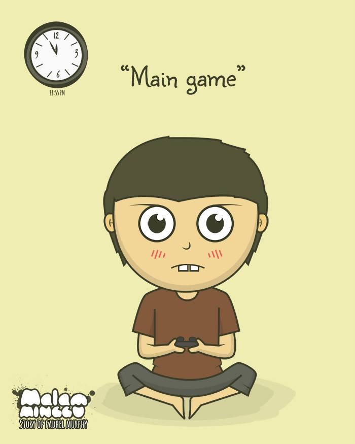
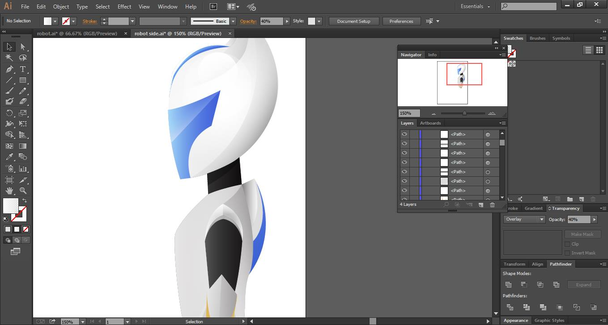
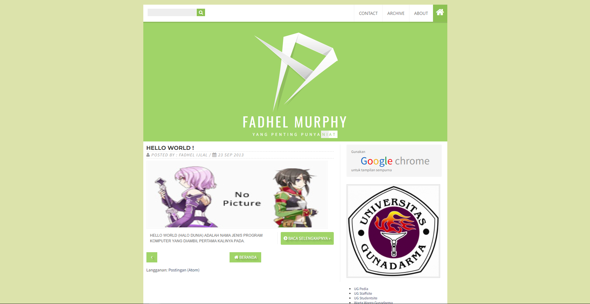
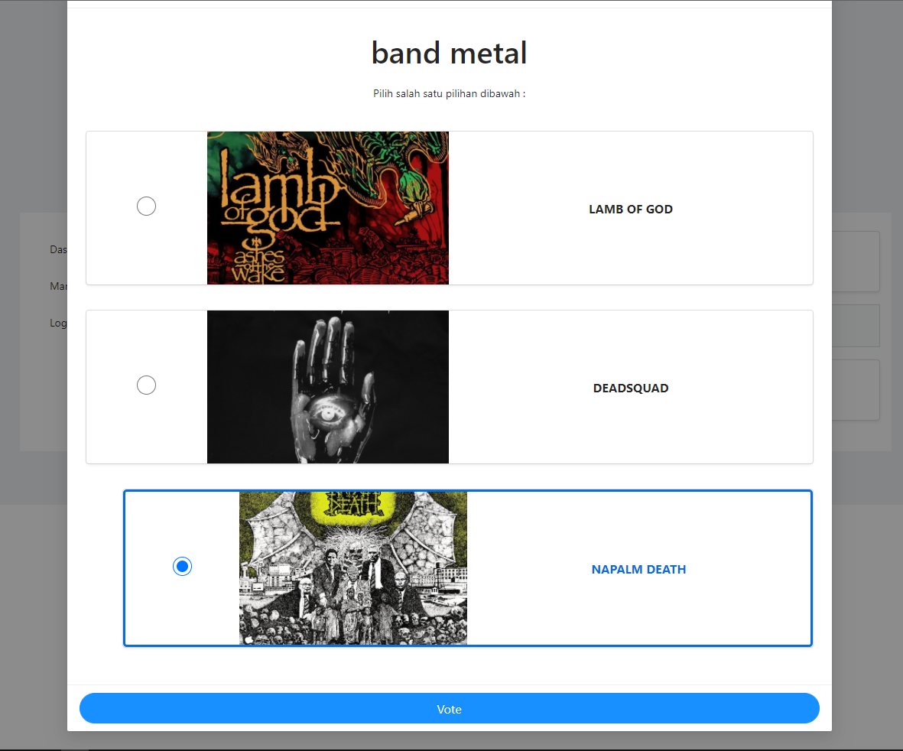
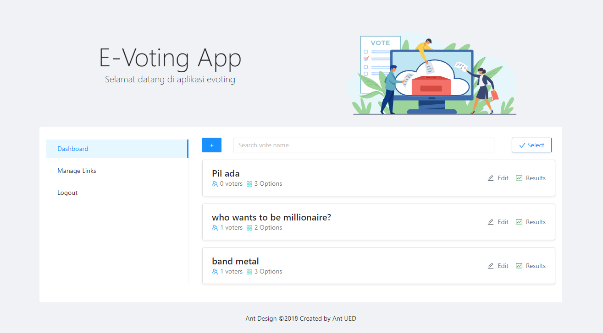
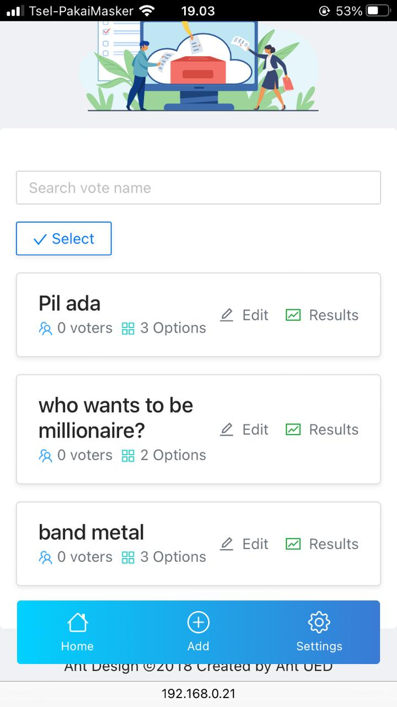

...

<h3>Artikel ini masih gue ketik...</h3>
<h6> masih belum bahas desain & hasil belajarnya</h6>

...

kok sekarang jadi frontend? gua jelasin timeline belajarnya gua dulu. Walaupun beberapa ada yg ga gua dalemin banget ya.

<h1>2014</h1>

<h3>Adobe Illustrator & Blogspot</h3>

Di tahun ini gua pake software AI buat bikin karya ilustrasi kayak logo, vector, karakter, poster, dll. Dibawah ini merupakan karya-karya yang udah pernah gua buat. Selain itu gue juga mainan html + css buat ngerubah tampilan blogspot gue.

<h5>...</h5>

<h5>...</h5>

<h1>2016</h1>

<h1>2017</h1>

<h3>PHP Native</h3>

gua mulai main php tapi gua ga mendalami karena bingung antara jadi desainer apa developer. gua memulai dengan php native dan membuat mvc sendiri (karena dulu sempet di masa anti banget ama framework haha). gua juga sempet pake php untuk scripting (CLI based).

<!-- 

 -->

<h1>2017</h1>

<h3>Express.js</h3>

mulai main nodejs karena saat itu kayaknya “wah” dan mulai mendalami express.js. disitu gue mulai belajar ngebuat pattern. sebenernya 2020 gua baru tau itu istilahnya design pattern wkwk selama ini gua cuma ngebuatnya biar rapih dan reusable.

<h6>Pertengahan</h6>
<h1>2018</h1>

<h3>
Angular
</h2>

sebenernya gua belajar angular itu juga ga sengaja cuy. waktu itu gua ada seleksi aslab yg tugasnya bikin aplikasi dan dikasih waktu 2 minggu. gua yg saat itu cuma ngerti express.js + mysql tapi gua mulai menantang diri ngecobain MEAN stack (MongoDB, Express,Angular, NodeJS) untuk ngebuat aplikasi vote. beruntungnya gua pake MongoDB jadi ga perlu banyak table tinggal kirim objek yg isinya array dan jadinya vote itu bisa multiple gak cuma dua opsi. di angularnya juga bisa dynamic option (ini basic logic javascript sih). h-2 sebelum task itu dikumpulin gua iseng update angular dengan cuma ganti versi nya di package.json tapi ternyata langsung error anying. gua search di google ternyata si angular ini punya treatment khusus untuk setiap versinya kalo upgrade. tapi waktu itu gue nemu cara buat migration nya.
semenjak itu gua ga mau lagi pake angular karena struktur foldernya dan upgrade tiap versinya.
  
6 bulan ga ngoding karena mulai “fokus” kuliah + ngebucin lah yaa karena dunia ini ga cuma kodingan wkwk.

<h1>2019</h1>

<h3>React</h3>

gue mulai belajar react untuk ngebuat aplikasi yg gagal di realisasikan (proyeknya tertunda) dan gua ga dapet bayaran. disitu gua mulai belajar component lifecycle. disini termasuk aplikasi buruk yg pernah gua buat wkwk (untungnya ga jadi di realisasiin anjir). gue banyak pake third party CDN yg mana tidak terload sempurna. bahkan bootstrap pun gua pake cdn. cdn nya di load laravel.
disini gua belom kenal state management,antd apalagi tailwind. begonya gua tuh ga baca roadmap belajarnya dan ga riset dulu kek orang lain pake react kayak gimana. cuma install react dan cari cara routing dan load component. 
  
pertengahan semester mulai bikin aplikasi website pake c# karena emang tugas disuruh pake c#. Ini ga gue dalemin karena developmentnya berat bat cuuy.

<h1>2019</h1>
<h6>akhir</h6>

<h1>2020</h1>
<h6>awal</h6>

<h3>Tensorflow</h3>

Mulai main Tensorflow dan Scikit-learn untuk riset topik penulisan ilmiah gue di kampus. Gue memutuskan menggunakan scikit-learn untuk klasifikasi teks di penulisan ilmiah dengan stacknya yaitu sklearn, sastrawi, flask, dan metode naive bayes. Disini gue mulai belajar untuk menghitung akurasi menggunakan confusion matrix, preprocessing teks, feature engineering, dll.

<h6>Pertengahan</h6>
<h1>2020</h1>

<h3>
Blender 3D
</h3>

karena ada tugas grafkom yg menggunakan Blender 3D jadinya gue sempet nyemplung ke dunia visual 3D. disamping itu gue mainan flutter dengan state managementnya Bloc. Main flutter ternyata kurang enak dibaca ya, dia programmingnya menggunakan bahasa dart yang di dalam child ada child lagi wkwk.

<h6>September</h6>
<h1>2020</h1>

<h3>
Gatsby.js
</h3>

gue mulai balik lagi main React dan ngedesain ulang blog ini menggunakan gatsby. mulai main Redux juga. Di waktu yg bersamaan gue juga belajar klasifikasi gambar menggunakan Deep Learning (CNN).

<h6>Desember</h6>
<h1>2020</h1>

<h3>
Next.js
</h3>

Dosen gue butuh web developer untuk proyeknya dan gue apply ke dia melalui WA dengan teks yg panjang yg intinya memperkenalkan diri dan portofolio gue. gue diterima, tapi dia ga bilang kalo stacknya pake Next.js, Redux-saga, dan Antd. Disini gue sempet mengundurkan diri tapi dosen gue nolak wkwk. Yaudah gue try so hard untuk mahamin Next.js, Redux-saga dan Antd. Pokoknya Redux-saga itu kompleks cuy ga kayak redux biasa. Dia perlu store dan ketika fetching datanya langsung di lempar ke global state. kodingan gue disini lumayan berantakan karena gue juga masih mahamin pattern nya dan proyek yg gue handle itu e-commerce wkwk. akhirnya gue berhasil menyelesaikan tasknya tapi dosen gue gamau rekrut gue lagi wkwk.

<h1>2021</h1>

<h3>
Skripsi
</h3>

gue sibuk skripsi karena topiknya ditentuin dosen gue. mau gamau gue harus belajar penerapan image processing pada citra fundus retina. intinya gimana caranya pembuluh darah retina bisa jadi id yg unik untuk setiap orang. 

<h6>September</h6>
<h1>2021</h1>

<h3>
Internship Frontend
</h3>

gue mengikuti program internship dari kampus gue yang memiliki persyaratan dengan 
<b>minimal sudah sidang Penulisan Ilmiah (PI) (minimal semester 7).</b> Gue yg baru lulus (udah Sidang PI dan Sidang Skripsi) saat itu mencoba apply dan keterima.

<b>*FYI</b> 
Di kampus gue ada 2x sidang. Sidang PI dilaksanakan di Semester 6 dan sidang Skripsi dilaksanakan di Semester 8.
 

di internship ini mengajarkan tentang React, Next.js, Redux,
dan Bootstrap. Karena sebelumnya gue udah mempelajari stack ini jadinya gue bisa <i>leha-leha</i> untuk ngikutin internshipnya. Bahkan di bulan November-Januari gue Kerja (WFO) sambil mengikuti Internship (WFH).

<h6>November</h6>
<h1>2021</h1>

<h3>
Fullstack Developer (Desktop)
</h3>

gue apply beberapa perusahaan dari berbagai role yaitu backend, frontend, data science, dan ML Engineer. gue mendapatkan pekerjaan pertama gue (full time) sebagai Fullstack Developer dengan stacknya menggunakan bahasa C++, VB, dan MySQL. disini gue harus juga belajar mengenai saham karena gue bekerja di industri keuangan. karena fullstack disini dibagi-bagi cuy jadi ga semuanya dipegang tapi cukup sekedar tau mengenai salah satu bahasa tersebut. sebagai gambaran 50% knowledge saham dan 50% ngoding VB. Karena gue orangnya lebih suka urus technical (ngoding) jadinya gue memutuskan untuk resign.

<h1>2022</h1>

<h3>
Frontend
</h3>

Gue bekerja sebagai Jr. Frontend developer yang dimana stacknya mirip dengan proyek dosen gue wkwk. gue masih harus belajar banyak soal Frontend. Per hari ini lu baca gue masih belom paham mengenai micro-frontend antar framework dan komunikasi statenya antar framework, unit testing, CI/CD untuk deployment, masih belum lancar setup PM2.

<h1>Kedepannya?</h1>

gue masih mencoba mendalami frontend tapi masih belom tau bakalan tetep jadi frontend atau switch ke backend, data science, graphic design, perpajakan, dan atau ilmu administrasi. hal-hal diluar frontend lagi gue coba dalamin tapi untuk selingan.

