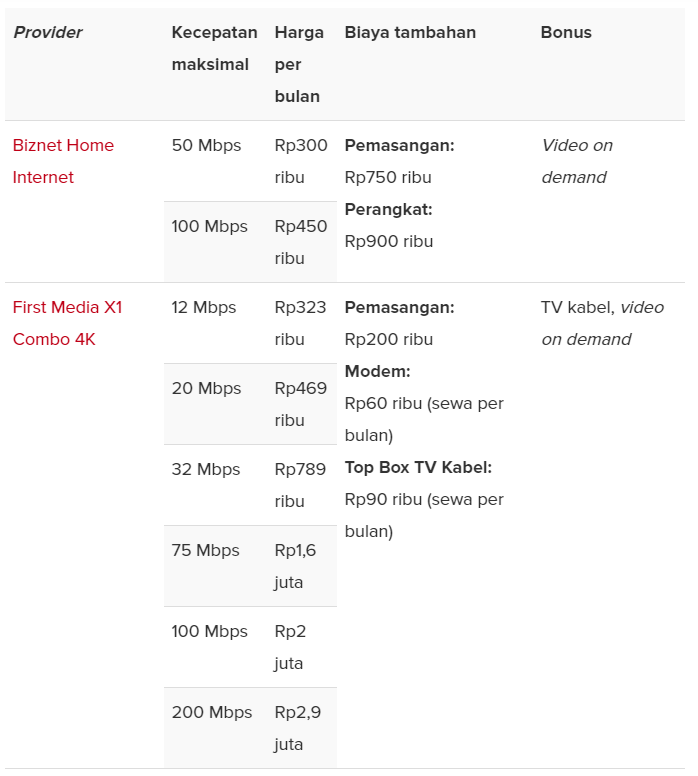
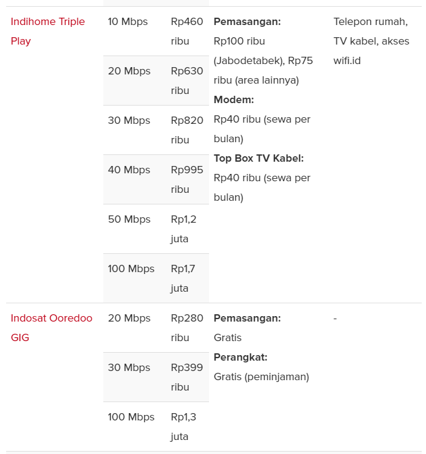
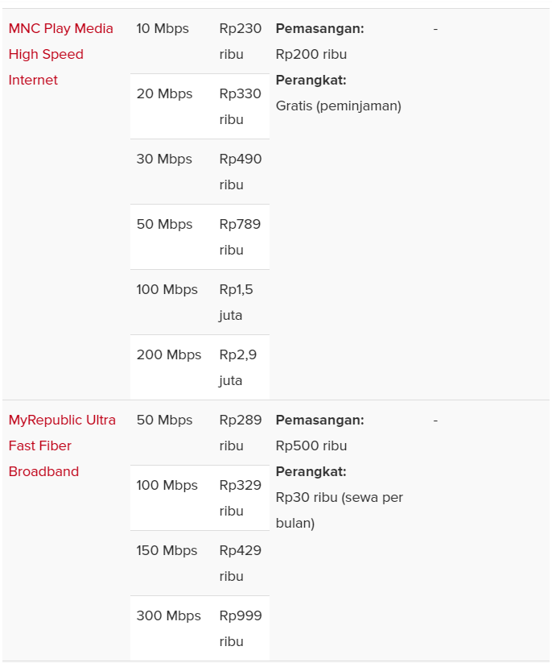
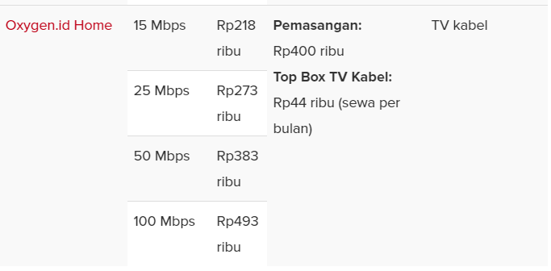

&nbsp;&nbsp;&nbsp;&nbsp;&nbsp;&nbsp;&nbsp;&nbsp;&nbsp;&nbsp;Biznet merupakan perusahaan infrastruktur digital terintegrasi di Indonesia, menyediakan layanan Internet, Data Center, Cloud Computing dan IPTV. Kami memiliki komitmen untuk membangun infrastruktur modern dengan tujuan mengurangi kesenjangan digital Indonesia dengan negara berkembang lainnya. Biznet memiliki dan mengoperasikan jaringan Fiber Optic tercanggih dan data center terbesar di Indonesia.

<h4 data-aos="fade-up">Visi Perusahaan</h4>

Indonesia dimana setiap individu dan bisnis dapat terhubung dengan lancar untuk menggapai potensi mereka secara individu dan kolektif.

<h4 data-aos="fade-up">Misi Perusahaan</h4>

Menjadi perusahaan solusi jaringan dan multimedia melalui komitmen kami untuk inovasi kelas dunia, infrastruktur dan jasa.

<h4 data-aos="fade-up">Lembar fakta perusahaan</h4>

<b><a href="https://www.biznetnetworks.com/assets/biznet-corporate-fact-sheet-2020-1600239833.pdf">Unduh Lembar Fakta Perusahaan</a></b>

<h2 class="text-center" data-aos="fade-up">Biznet Milestone</h2>

Meningkatnya kebutuhan akan infrastruktur jaringan yang handal membuat kami paham bahwa banyak perusahaan tergantung pada kehandalan infrastruktur untuk bisnis mereka.

Biznet berdiri pada tahun 2000 sebagai Internet Service Provider yang menyediakan kebutuhan Internet untuk pelanggan bisnis. Pada tahun 2000, Biznet menggunakan teknologi Wireless dan In-Building Ethernet sebagai jalur distribusi layanan Internet kami. Pada tahun 2005, kami mulai beralih menggunakan jaringan Fiber Optic kami sendiri untuk mendistribusikan seluruh layanan Internet dan Network kami. Berkat dukungan dari tim Engineering terbaik dan penuh komitmen, Biznet mulai merintis jalan untuk menjadi salah satu perusahaan telekomunikasi dan multimedia terdepan di Indonesia.

<section class="section-bg py-5">
    

        

                        

                

                    

                        <h4 class="year">2000</h4>
                    

                

                

                    <h5 class="happening_title">Biznet Mulai Beroperasi</h5>
                    

Pada 1 Oktober 2000, Biznet mulai beroperasi sebagai Broadband Internet Service Provider di Kompleks MidPlaza Jakarta.

                    
<strong></strong>

                

            
<!-- ends: .happening -->
                        

                

                    

                        <h4 class="year">2001</h4>
                    

                

                

                    <h5 class="happening_title">Biznet Luncurkan Data Center Jakarta</h5>
                    

Biznet meluncurkan Biznet Data Center Jakarta - MidPlaza, dengan fasilitas Tier-2 dengan raised floor seluas 700m2.

                    
<strong></strong>

                

            
<!-- ends: .happening -->
                        

                

                    

                        <h4 class="year">2002</h4>
                    

                

                

                    <h5 class="happening_title">Biznet Luncurkan Teknologi Laser dan Wireless Terbaru</h5>
                    

Biznet menggunakan teknologi Laser dan Wireless untuk menghubungkan 7 gedung-gedung tinggi di kawasan pusat bisnis Jakarta.

                    
<strong></strong>

                

            
<!-- ends: .happening -->
                        

                

                    

                        <h4 class="year">2003</h4>
                    

                

                

                    <h5 class="happening_title">Biznet Umumkan Layanan Broadband untuk UKM</h5>
                    

Biznet meluncurkan layanan Internet Broadband untuk Usaha Kecil dan Menengah (UKM) dan perumahan dengan menggunakan teknologi ADSL.

                    
<strong></strong>

                

            
<!-- ends: .happening -->
                        

                

                    

                        <h4 class="year">2004</h4>
                    

                

                

                    <h5 class="happening_title">Biznet Umumkan GlobalPOP di Singapura</h5>
                    

Biznet mulai mengoperasikan GlobalPOP di Singapura sebagai pusat Global Internet.

                    
<strong></strong>

                

            
<!-- ends: .happening -->
                        

                

                    

                        <h4 class="year">2005</h4>
                    

                

                

                    <h5 class="happening_title">Biznet Luncurkan Jaringan Fiber Optic Pertama</h5>
                    

Biznet pertama kalinya membangun jaringan Fiber Optic di kawasan pusat bisnis Jakarta dengan menggunakan teknologi Metro Ethernet dengan konfigurasi ring.

                    
<strong>Total Biznet Fiber route: 10 KM.</strong>

                

            
<!-- ends: .happening -->
                        

                

                    

                        <h4 class="year">2006</h4>
                    

                

                

                    <h5 class="happening_title">Biznet Umumkan GlobalPOP di Tokyo</h5>
                    

<strong></strong>Biznet meluncurkan GlobalPOP di Tokyo dan peering dengan Japan Internet Exchange
                                        (JPIX). Biznet juga memperluas jaringan Fiber Optic untuk menjangkau area yang
                                        lebih luas dikawasan pusat bisnis Jakarta.

                    
<strong>Total rute Biznet Fiber: 50 KM.</strong>

                

            
<!-- ends: .happening -->
                        

                

                    

                        <h4 class="year">2007</h4>
                    

                

                

                    <h5 class="happening_title">Biznet Luncurkan Teknologi Fiber to the Home (FTTH)</h5>
                    

Biznet untuk pertama kalinya mengoperasikan jaringan Biznet Fiber dengan
                                        teknologi Fiber To The Home (FTTH), yang merupakan jaringan FTTH yang pertama
                                        di Asia Tenggara.

                    
<strong>Total rute Biznet Fiber: 250 KM.</strong>

                

            
<!-- ends: .happening -->
                        

                

                    

                        <h4 class="year">2008</h4>
                    

                

                

                    <h5 class="happening_title">Biznet Luncurkan Biznet InterCity</h5>
                    

Biznet membangun jaringan Biznet InterCity Sepanjang 300 KM antar Serang, Banten
                                        dan Bandung, Jawa Barat untuk menyediakan layanan di area tersebut.

                    
<strong>Total rute Biznet Fiber: 1,000 KM.</strong>

                

            
<!-- ends: .happening -->
                        

                

                    

                        <h4 class="year">2009</h4>
                    

                

                

                    <h5 class="happening_title">Biznet Luncurkan Biznet Fiber Bali</h5>
                    

Biznet memperluas jaringan Biznet Fiber di Bali dengan rute jaringan sepanjang
                                        30 KM.

                    
<strong>Total rute Biznet Fiber: 1,200 KM.</strong>

                

            
<!-- ends: .happening -->
                        

                

                    

                        <h4 class="year">2010</h4>
                    

                

                

                    <h5 class="happening_title">Biznet Umumkan Pembangunan Biznet Technovillage</h5>
                    

Biznet memulai proyek Biznet Technovillage, sebuah Data Center Tier-3 di
                                        Cimanggis, Jawa Barat dan meluncurkan layanan Cloud Computing untuk Enterprise.

                    
<strong>Total rute Biznet Fiber: 1,500 KM.</strong>

                

            
<!-- ends: .happening -->
                        

                

                    

                        <h4 class="year">2011</h4>
                    

                

                

                    <h5 class="happening_title">Biznet Luncurkan Peluncuran Biznet Venture</h5>
                    

Biznet meluncurkan Biznet Venture sebagai inkubator untuk perusahaan startup. Biznet meluncurkan dua GlobalPOP terbaru di Manila, Filipina dan Sydney, Australia. Biznet mulai menggunakan alamat IPV6.

                    
<strong>Total rute Biznet Fiber: 2,500 KM.</strong>

                

            
<!-- ends: .happening -->
                        

                

                    

                        <h4 class="year">2012</h4>
                    

                

                

                    <h5 class="happening_title">Biznet Luncurkan max3 Studioworks</h5>
                    

Biznet memulai max3 Studioworks, sebuah fasilitas multimedia untuk memproduksi content secara in-house. Biznet Technovillage mulai beroperasi pada 18 Juli 2012. Biznet meluncurkan max3 Internet + Cable TV untuk perumahan dan apartment pada tanggal 6 Desember 2012.

                    
<strong>Total rute Biznet Fiber: 5,000 KM.</strong>

                

            
<!-- ends: .happening -->
                        

                

                    

                        <h4 class="year">2013</h4>
                    

                

                

                    <h5 class="happening_title">Biznet Perkenalkan Layanan Cloud Computing</h5>
                    

Biznet meluncurkan Cloud Computing untuk Usaha Kecil dan Menengah (UKM). Layanan max3 Internet + Cable TV mulai dioperasikan di Bali dan jaringan perumahan Biznet Fiber secara nasional telah mencakup 120,000 homepass.

                    
<strong>Total rute Biznet Fiber: 7,500 KM.</strong>

                

            
<!-- ends: .happening -->
                        

                

                    

                        <h4 class="year">2014</h4>
                    

                

                

                    <h5 class="happening_title">Biznet Perluas Jaringan ke Pulau Sumatra</h5>
                    

Biznet memperluas jaringan Fiber Optic ke Pulau Sumatera dan membuka kantor cabang baru di Palembang, Jambi dan Padang. Biznet Data Center Bali mulai beroperasi pada 10 April 2014. Jaringan perumahan Biznet Fiber secara nasional telah mencakup 200,000 homepass.

                    
<strong>Total rute Biznet Fiber: 11,000 KM.</strong>

                

            
<!-- ends: .happening -->
                        

                

                    

                        <h4 class="year">2015</h4>
                    

                

                

                    <h5 class="happening_title">Biznet Umumkan Biznet Rebranding</h5>
                    

Biznet mulai mengoperasikan beberapa kantor cabang Jawa Barat &amp; Jawa Tengah. Biznet melakukan rebranding terhadap logo dan nama layanan secara keseluruhan. Jaringan perumahan Biznet Fiber secara nasional telah mencakup 240,000 homepass. Biznet Fiber Java Bangka Batam Singapore mulai beroperasi pada 7 Agustus 2015 dengan kapasitas 2x100 Gbps.

                    
<strong>Total rute Biznet Fiber: 15,000 KM.</strong>

                

            
<!-- ends: .happening -->
                        

                

                    

                        <h4 class="year">2016</h4>
                    

                

                

                    <h5 class="happening_title">Biznet Perluas Jaringan ke Pulau Batam</h5>
                    

Biznet perluas jaringan Biznet Fiber ke Pulau Batam dan lebih banyak kota di Pulau Jawa. Jaringan Biznet Fiber Jawa - Bali terus diperluas mulai dari Kota Semarang hingga ke Kota Surabaya. Jaringan distribusi Biznet Fiber Home telah mencapai 350,000 homepass.

                    
<strong>Total rute Biznet Fiber: 18,000 KM.</strong>

                

            
<!-- ends: .happening -->
                        

                

                    

                        <h4 class="year">2017</h4>
                    

                

                

                    <h5 class="happening_title">Biznet Perluas Jaringan ke Lebih Banyak Kota di Pulau Jawa</h5>
                    

Biznet perluas jaringan Biznet Fiber ke Kota Kudus dan lebih banyak kota di Pulau Jawa. Pembangunan dan perluasan rute jaringan Biznet Fiber Semarang - Surabaya mulai beroperasi. Jaringan distribusi Biznet Fiber Home mencapai 450,000 homepass.

                    
<strong>Total rute Biznet Fiber: 21,000 KM.</strong>

                

            
<!-- ends: .happening -->
                        

                

                    

                        <h4 class="year">2018</h4>
                    

                

                

                    <h5 class="happening_title">Biznet Luncurkan The New Biznet Fiber</h5>
                    

Biznet perluas Biznet Fiber ke Garut, Tasikmalaya, Cilacap dan kota-kota lainnya
                                        di pulau Jawa. Jaringan distribusi Biznet Fiber Home mencapai 480,000 homepass.

                    
<strong>Total rute Biznet Fiber: 27,000 KM.</strong>

                

            
<!-- ends: .happening -->
                        

                

                    

                        <h4 class="year">2019</h4>
                    

                

                

                    <h5 class="happening_title">Biznet Perluas Jaringan ke Pontianak</h5>
                    

Biznet perluas Biznet Fiber ke Singaraja - Bali, Batu Aji - Batam, dan banyak kota di Pulau Jawa, Bali dan Batam. Jaringan Biznet Fiber hadir di Pontianak, Kalimantan Barat. Jaringan distribusi Biznet Fiber Home mencapai 500,000 homepass.

                    
<strong>Total rute Biznet Fiber: 36,000 KM.</strong>

                

            
<!-- ends: .happening -->
                        

                

                    

                        <h4 class="year">2020</h4>
                    

                

                

                    <h5 class="happening_title">Biznet Luncurkan Biznet IPTV dan PrimaMedix</h5>
                    

Biznet resmi meluncurkan layanan Biznet IPTV dan memperluas jaringan Biznet Fiber ke Sulawesi dengan secara resmi membuka kantor cabang baru di Manado.

Pada 8 Agustus 2020, Biznet meluncurkan anak perusahaan terbaru, PrimaMedix sebagai perusahaan manufaktur produk kesehatan untuk kebutuhan sehari-hari dan industri.

                    
<strong>Total rute Biznet Fiber: 45,000 KM.</strong>

                

            
<!-- ends: .happening -->
            
        

    

</section>

<h3>Perbandingan harga</h3>

<h2>Kesimpulan</h2>

&nbsp;&nbsp;&nbsp;&nbsp;&nbsp;&nbsp;&nbsp;&nbsp;&nbsp;&nbsp;Perusahaan IT Biznet yang sudah lama berdiri tetap bertahan hingga saat ini karena terus memberikan layanan yang memuaskan bagi para pengguna nya. Meskipun perusahaan ini terbilang lebih muda dibandingkan pesaing- pesaingnya seperti Indihome, First Media. Namun perusahaan ini terus membangun jaringan Biznet Fiber diseluruh area di Indonesia. Sehingga beragam kota di Indonesia dapat merasakan manfaat adanya layanan internet berkecepatan tinggi. Paket Internet Biznet pun tergolong murah hanya dengan Rp. 300.000 mendapatkan kecepatan sebesar 50 Mbps

<h6>Sumber : </h6>

Biznet, 2020. <i><a href="https://www.biznetnetworks.com/">https://www.biznetnetworks.com/</a></i>

Tech in Asia, 2020. <i><a href="https://id.techinasia.com/inilah-4-provider-internet-broadband-di-indonesia">https://id.techinasia.com/inilah-4-provider-internet-broadband-di-indonesia</a></i>
