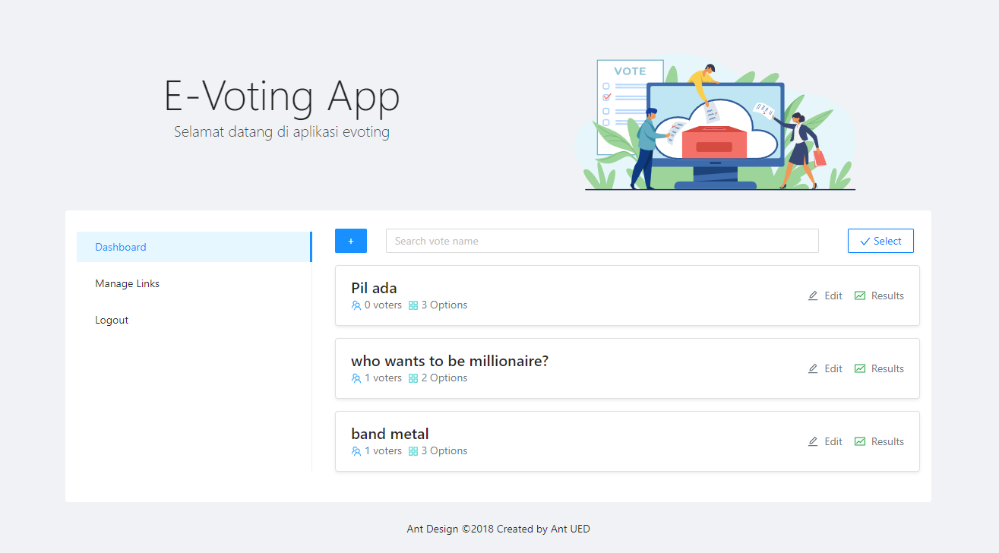
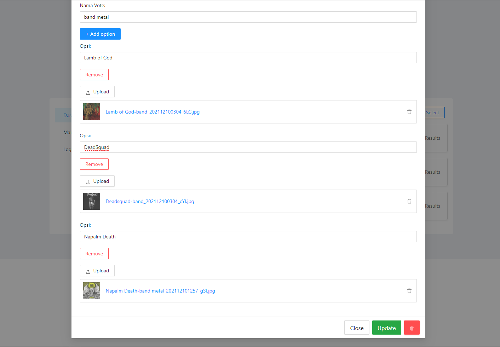
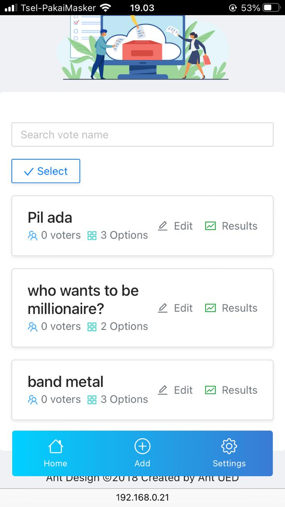
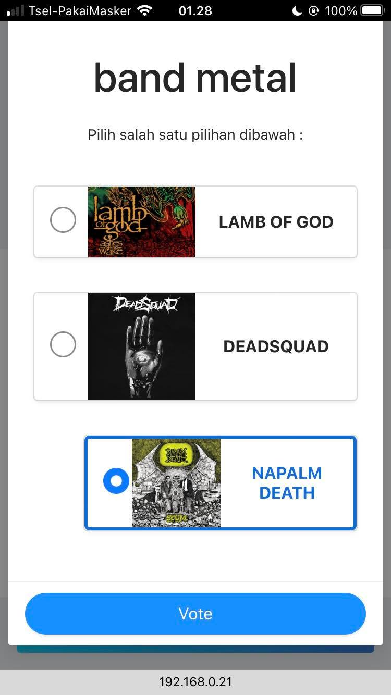
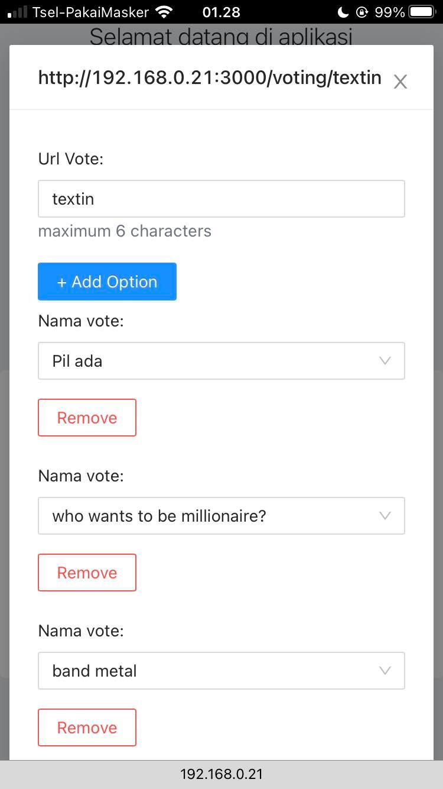
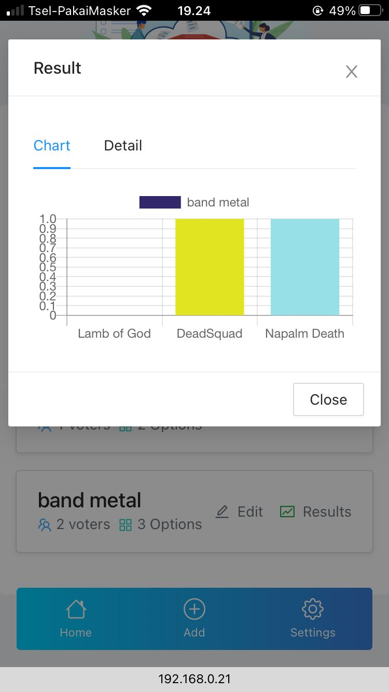

&nbsp;&nbsp;&nbsp;&nbsp;&nbsp;&nbsp;&nbsp;&nbsp;&nbsp;&nbsp;Ini merupakan aplikasi hasil kegabutan saya selama liburan. Pada saat development saya memiliki kesulitan untuk membuat relasi antar data yang multiple dan dinamis sehingga saya meminta bantuan teman saya yaitu yazid dan rema untuk merancang ulang backend yang sebelumnya saya buat. Di sisi frontend saya menggunakan react.js dengan context state management. untuk UI nya saya menggunakan Antd dan bootstrap.

<h1>
Stack
</h1>

<h4>
Backend
</h4>

Laravel & Sanctum   
<b><a target="_blank" href="https://github.com/fadhelmurphy/backend-vote-laravel">Source code →</a></b>

<h4>
Frontend
</h4>

React.js, Axios, Context state management, Antd, dan Bootstrap   
<b><a target="_blank" href="https://github.com/fadhelmurphy/frontend-vote-react">Source code →</a></b>

<h1>
Kalo lewat hp bisa gak? Sabi cuy!
</h1>

Aplikasi Vote ini dapat kamu akses melalui mobile ataupun desktop

<h5 class="text-uppercase" style="color:#7bc678">
Feature
</h5>
<h2>
Satu link dapat terdiri dari 1 atau lebih jenis vote
</h2>

Anda dapat men generate link dengan memilih jenis vote yang diinginkan dengan klik select lalu pilih share.

<h2>
Kalo url linknya custom? Bisa dong!
</h2>

Dengan klik menu manage links dan pilih salah satu code yg telah di generate dan ubah namanya sesuai keinginan anda

<h3>
Jumlah voter disajikan dalam bentuk grafik yang memudahkan kamu untuk melihatnya.
</h3>

<h3>
Kalo ada voter nyasar voting gimana?
</h3>

Tenang, voter dapat dihapus oleh pembuat vote dengan memilih tab detail lalu klik icon tong sampah.

