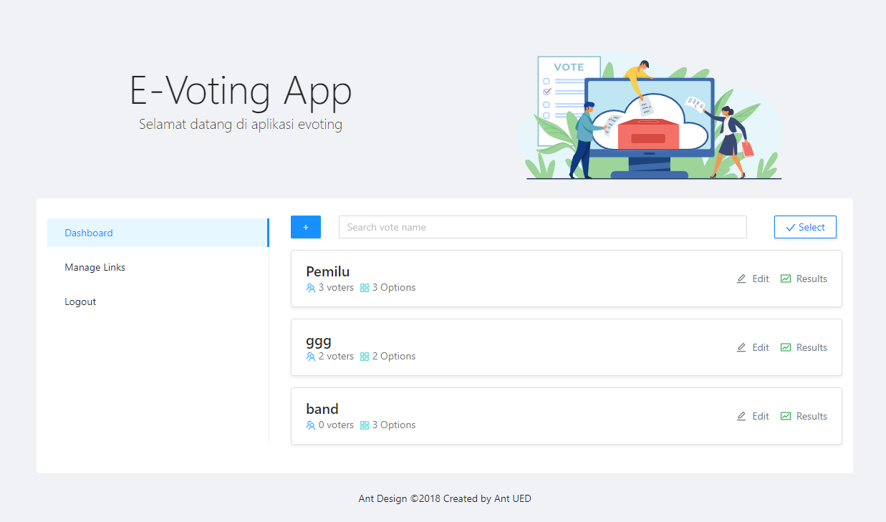

&nbsp;&nbsp;&nbsp;&nbsp;&nbsp;&nbsp;&nbsp;&nbsp;&nbsp;&nbsp;Ini merupakan aplikasi hasil kegabutan saya selama liburan. Pada saat development saya memiliki kesulitan untuk membuat relasi antar data yang multiple dan dinamis sehingga saya meminta bantuan teman saya yaitu yazid dan rema untuk merancang ulang backend yang sebelumnya saya buat. Di sisi frontend saya menggunakan react.js dengan context state management. untuk UI nya saya menggunakan Antd dan bootstrap.

<h1>
Stack
</h1>

<h4>
Backend
</h4>

Laravel & Sanctum   
<b><a target="_blank" href="https://github.com/fadhelmurphy/backend-vote-laravel">https://github.com/fadhelmurphy/backend-vote-laravel</a></b>

<h4>
Frontend
</h4>

React.js, Axios, Context state management, Antd, dan Bootstrap   
<b><a target="_blank" href="https://github.com/fadhelmurphy/frontend-vote-react">https://github.com/fadhelmurphy/frontend-vote-react</a></b>

